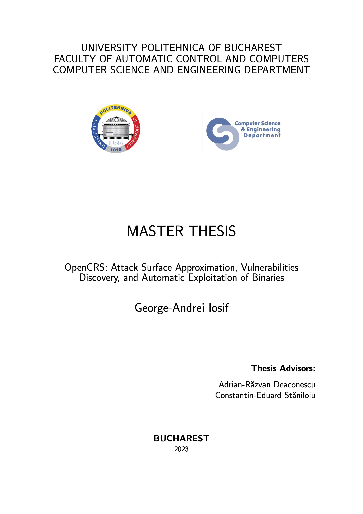

# Master's Thesis 📕

## Description 📖

This repository contains documents and sources for my master's thesis, primarily LaTeX source code and diagrams.net diagrams.

The thesis is titled "OpenCRS: Attack Surface Approximation, Vulnerabilities Discovery, and Automatic Exploitation of Binaries", and it was written at University POLITEHNICA of Bucharest. The implementation of the project described here can be found in the [OpenCRS organization's repositories](https://github.com/CyberReasoningSystem).

The templates used for these documents can be obtained in a repository separate from the @cs-pub-ro organization, namely [`templates`](https://github.com/cs-pub-ro/templates). Please see cs-pub-ro/templates#1 for more details.

## Preview 👀

| Thesis                                                                                                       | Presentation                                                                                                                         |
|--------------------------------------------------------------------------------------------------------------|--------------------------------------------------------------------------------------------------------------------------------------|
| <a href="thesis/export.pdf"><kbd></kbd></a> | <a href="presentation/export.pdf"><kbd></kbd></a> |
